# InfoGraphics

GitHubのMarkdownファイル（`.md`）に各種の図形を表示する方法を紹介します。

---

## 目次

1. [Mermaid ダイアグラム](#1-mermaid-ダイアグラム)
   - [フローチャート](#フローチャート)
   - [シーケンス図](#シーケンス図)
   - [クラス図](#クラス図)
   - [ガントチャート](#ガントチャート)
   - [円グラフ](#円グラフ)
   - [ER図](#er図)
2. [SVG 画像](#2-svg-画像)
3. [HTMLテーブルによるビジュアル表現](#3-htmlテーブルによるビジュアル表現)
4. [テキストアート（AAアート）](#4-テキストアートaaアート)
5. [まとめ](#5-まとめ)

---

## 1. Mermaid ダイアグラム

GitHub は 2022年より Mermaid ダイアグラムをネイティブサポートしています。  
コードブロックの言語指定を `` ```mermaid `` にするだけで図形が描画されます。

### フローチャート

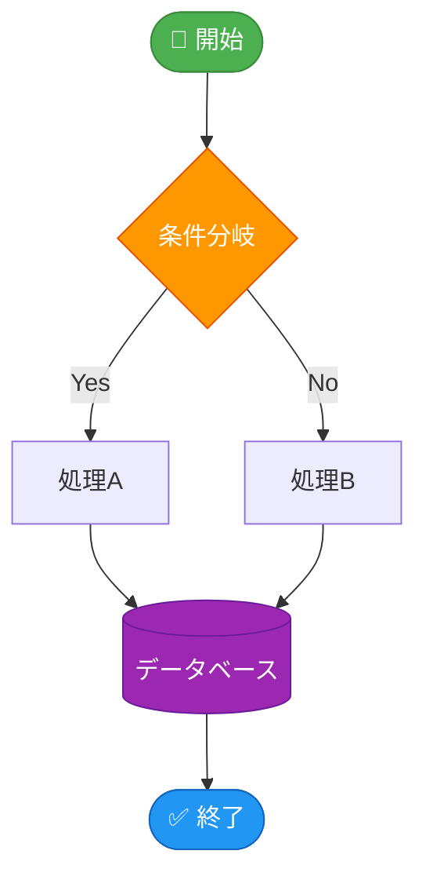

**書き方：**

````md
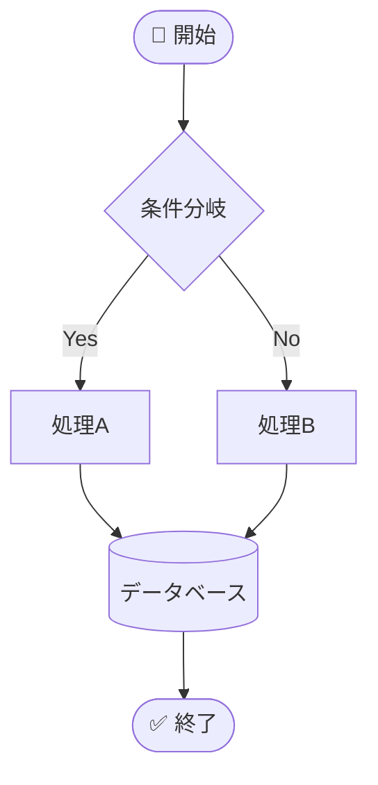
````

---

### シーケンス図

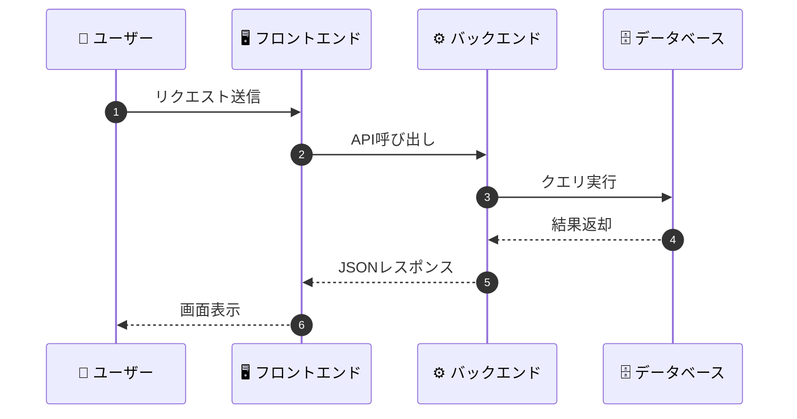

**書き方：**

````md
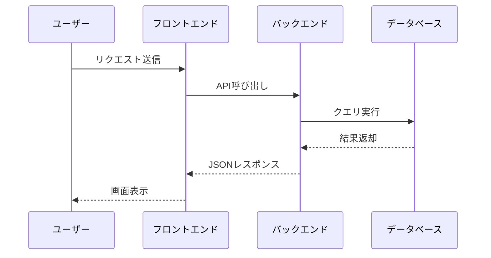
````

---

### クラス図

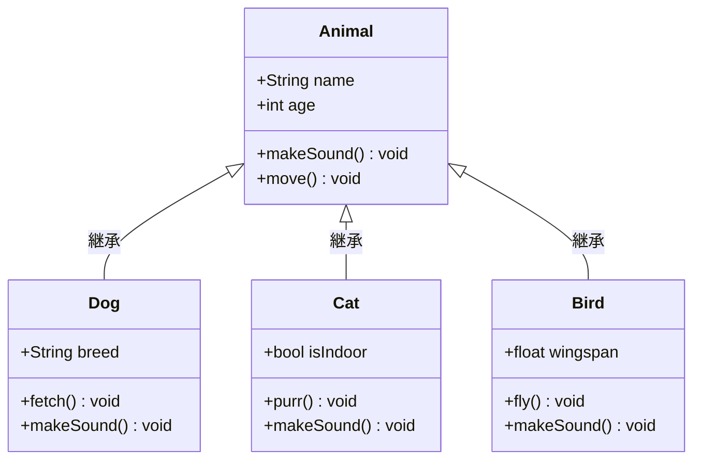

**書き方：**

````md
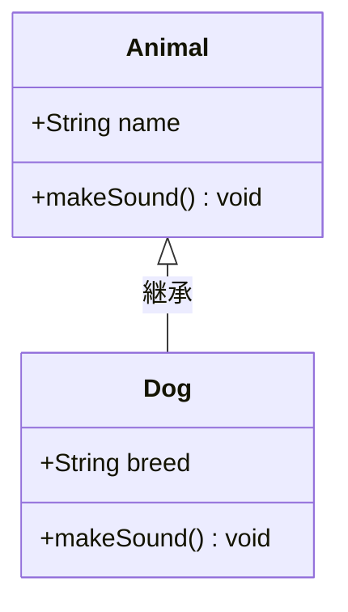
````

---

### ガントチャート

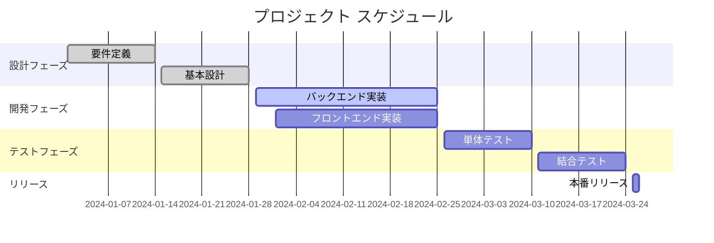

**書き方：**

````md
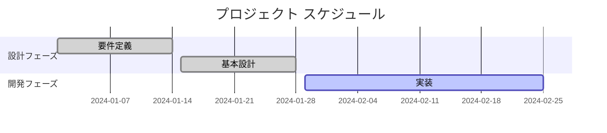
````

---

### 円グラフ

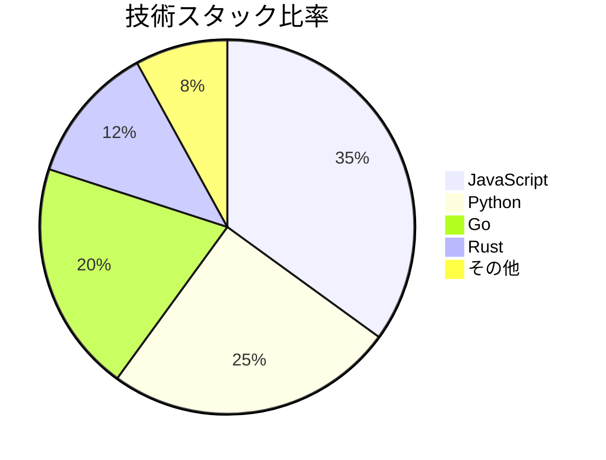

**書き方：**

````md
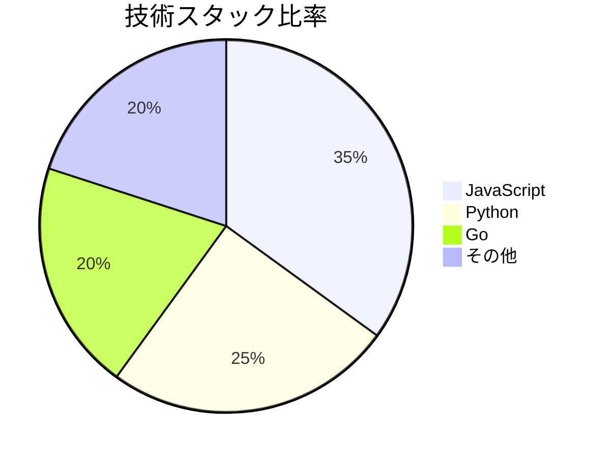
````

---

### ER図

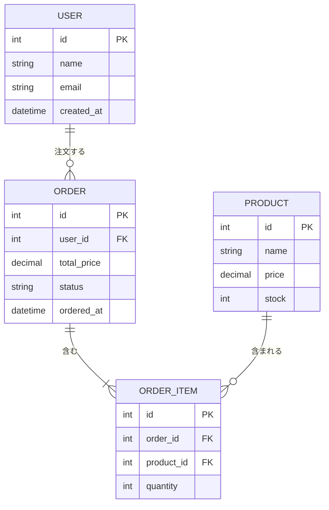

**書き方：**

````md
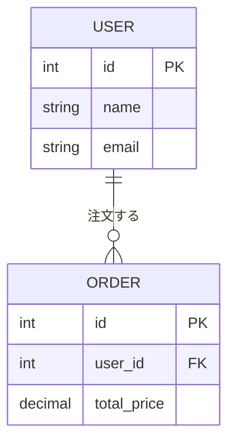
````

---

## 2. SVG 画像

SVGファイルをリポジトリに配置し、通常の画像と同じように参照できます。

```md
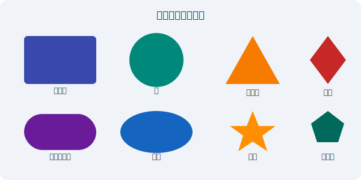
```


SVGは `` タグでサイズを指定して表示することもできます：

```md

```


---

## 3. HTMLテーブルによるビジュアル表現

GitHubのMarkdownでは一部のHTML要素が使用できます。

### バッジ（Shields.io）

Shields.ioを使ってステータスバッジを表示できます：

```md


```


### HTMLテーブルとインラインSVG

```html
<table>
  <tr>
    <th>図形</th>
    <th>SVG</th>
    <th>説明</th>
  </tr>
  <tr>
    <td>四角形</td>
    <td><svg width="60" height="40"><rect width="60" height="40" fill="#3949ab" rx="4"/></svg></td>
    <td><code>&lt;rect&gt;</code> タグを使用</td>
  </tr>
  <tr>
    <td>円</td>
    <td><svg width="60" height="40"><circle cx="30" cy="20" r="18" fill="#00897b"/></svg></td>
    <td><code>&lt;circle&gt;</code> タグを使用</td>
  </tr>
  <tr>
    <td>三角形</td>
    <td><svg width="60" height="40"><polygon points="30,2 58,38 2,38" fill="#f57c00"/></svg></td>
    <td><code>&lt;polygon&gt;</code> タグを使用</td>
  </tr>
</table>
```

<table>
  <tr>
    <th>図形</th>
    <th>SVG</th>
    <th>説明</th>
  </tr>
  <tr>
    <td>四角形</td>
    <td><svg width="60" height="40"><rect width="60" height="40" fill="#3949ab" rx="4"/></svg></td>
    <td><code>&lt;rect&gt;</code> タグを使用</td>
  </tr>
  <tr>
    <td>円</td>
    <td><svg width="60" height="40"><circle cx="30" cy="20" r="18" fill="#00897b"/></svg></td>
    <td><code>&lt;circle&gt;</code> タグを使用</td>
  </tr>
  <tr>
    <td>三角形</td>
    <td><svg width="60" height="40"><polygon points="30,2 58,38 2,38" fill="#f57c00"/></svg></td>
    <td><code>&lt;polygon&gt;</code> タグを使用</td>
  </tr>
</table>

---

## 4. テキストアート（AAアート）

コードブロックを使ってテキストアートで図形を表現できます。

### 基本図形

```
┌─────────────────────────────────────────┐
│              四角形（長方形）              │
└─────────────────────────────────────────┘

     ●
    ●●●
   ●●●●●    ◀ 三角形（テキスト）
  ●●●●●●●
 ●●●●●●●●●

 ╔══════════╗
 ║  二重罫線  ║
 ╚══════════╝
```

### システム構成図

```
                    ┌──────────────────────────────────────┐
                    │            クラウド環境                │
                    │                                      │
  ┌──────────┐      │  ┌──────────┐      ┌──────────┐     │
  │          │      │  │          │      │          │     │
  │  ユーザー  │─────▶│  ロードバ  │─────▶│  アプリ   │     │
  │          │      │  │ ランサー   │      │ サーバー   │     │
  └──────────┘      │  └──────────┘      └─────┬────┘     │
                    │                          │           │
                    │                    ┌─────▼────┐     │
                    │                    │          │     │
                    │                    │   DB     │     │
                    │                    │ サーバー   │     │
                    │                    └──────────┘     │
                    └──────────────────────────────────────┘
```

### フローチャート（テキスト）

```
  開始
   │
   ▼
┌──────┐     はい    ┌──────────┐
│ 条件 │─────────▶ │  処理A   │
└──────┘           └────┬─────┘
   │ いいえ              │
   ▼                    │
┌──────────┐            │
│  処理B   │            │
└────┬─────┘            │
     └──────────────────┘
              │
              ▼
            終了
```

---

## 5. まとめ

| 方法 | GitHubサポート | 難易度 | 特徴 |
|------|--------------|--------|------|
| **Mermaid** | ✅ ネイティブ対応 | ⭐⭐ | テキストベースでバージョン管理しやすい |
| **SVG画像ファイル** | ✅ 完全サポート | ⭐⭐⭐ | 高品質・スケーラブル |
| **PNG/JPG画像** | ✅ 完全サポート | ⭐ | シンプルで汎用的 |
| **インラインSVG (HTML)** | ✅ 一部サポート | ⭐⭐⭐ | HTMLテーブル内で使用可 |
| **Shields.ioバッジ** | ✅ 完全サポート | ⭐ | ステータス表示に最適 |
| **テキストアート** | ✅ 完全サポート | ⭐⭐ | 軽量・依存関係なし |

> **💡 ヒント：** Mermaidはソースコードとともに図形をバージョン管理できるため、ドキュメントの保守性が高くなります。複雑な図形にはSVGファイルを使用することをお勧めします。

---

## 関連ファイル

- [`figures/shapes.svg`](figures/shapes.svg) - 基本図形のSVGサンプル
- [`generateAI/llm-local-overview.html`](generateAI/llm-local-overview.html) - ローカルLLMのインフォグラフィック（HTML版）
